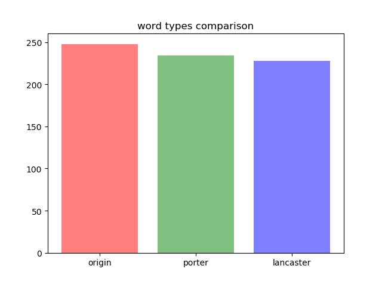
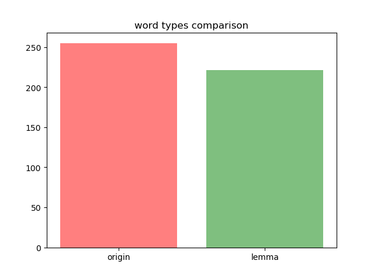
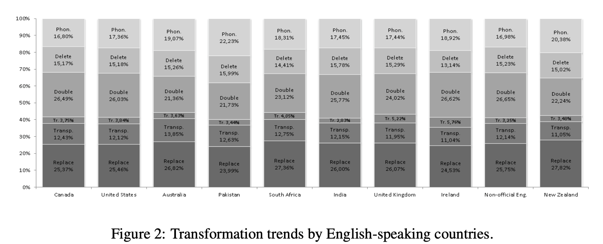
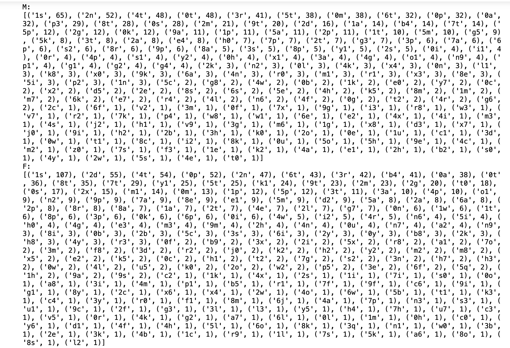

# homework for nlp 1
members:  
1. `Li Ruiyuan`
2. `Zhang Xuhao`
## excise 1: Mophology
- inflection
  - could->can
  - Imitating->imitate
  - Uses->use
- Derivation
   - actually->actual
   - Successful->success
   - Operation->operate
- Compounding
   - natural language processing
   - Text patterns
   - Text normalization
- Cliticisation
  - I’m
  - We’ll
  - User’s
## exercise 2: stemming
### 2a
N=248  
after stemming: 

    porter=234 
    lancaster=228


### 2b
#### omission
psychotherapist 
would
user's 
#### comission
- weizenbaum -> weizenba  (porter,lancaster)
  this is actually a name
- used->us (lancaster)
- care->car(lancaster)
- despite->despit(porter,lancaster)
- sometimes->sometim(porter,lancaster)
the stemmers just remove suffixes mechanically, including all the -ate, -e, -es, -s, -nize...
PorterStemmer started in the 1980s and its main concern is to delete the common endings of words so that they can be parsed into generic forms. It's not too complicated, and its development stopped.
While Lancaster's algorithm is more radical, sometimes the results will be strange.
And both of them are not performing well in terms of cliticisation.
```c
import nltk 
from nltk.stem import WordNetLemmatizer
from nltk.stem import PorterStemmer 
from nltk.stem import LancasterStemmer
import matplotlib.pyplot as plt
import matplotlib as mpl
wordnet_lemmatizer = WordNetLemmatizer()
#nltk.download()
porter=PorterStemmer()
lancaster=LancasterStemmer()
raw_list=[]
with open('sorted_types.txt','r') as f:
    line = f.read().strip('\n')
    raw_list = line.split("\n")
    
print(raw_list)
# output=[]
# for i in raw:
#     output.append(PorterStemmer.stem(i))
print("{0:20}{1:20}{2:20}".format("Word","Porter Stemmer","lancaster Stemmer"))
for word in raw_list:
    print("{0:20}{1:20}{2:20}".format(word,porter.stem(word),lancaster.stem(word)))
#nltk.corpus.gutenberg.fileids()

porter_list = []
lancaster_list = []
dic_porter = {}
dic_lancaster = {}
for word in raw_list:
    porter_list.append(porter.stem(word))
    lancaster_list.append(lancaster.stem(word))
    dic_porter[porter.stem(word)] =porter.stem(word)
    dic_lancaster[lancaster.stem(word)] =lancaster.stem(word)

name_list=["origin","porter","lancaster"]
num_list=[len(raw_list),len(dic_porter),len(dic_lancaster)]
print(num_list)
plt.bar(range(len(num_list)), num_list, color='rgb', tick_label=name_list,alpha=0.5)
plt.title('word types comparison') 
plt.show()

```
## exercise 3: lemmatization
### version1
using  ``from nltk.stem import WordNetLemmatizer``
#### 3a
lemmalized=242.
#### 3b
- an                  an
  'an' should be lemmatized as 'a',it is an omission
- as                  a
  'as'shouldn't be lemmatized, it is a comission
- converting          converting
  'converting'shouldn be lemmatized as convert, it is an omission
### version2
using `spacy and model:en_core_web_sm`
#### 3a
origin=255, lemmalized=221

#### 3b
- would  would
  'would' should be lemmatized as 'will',it is an omission
- separating  separating
    'separating' should be lemmatized as 'separate',it is an omission
- relies  relie
  'relies' should be lemmatized as 'rely',it is a rule problem. 
## exercise 4
### 4a
- Character duplication ：
  - Hummm
  - ZZZZZZZZZZZZzzzzzzzzzzzzzzzzz
  - Errrrrrrrr
- Number transliteration ：
  - man2
  - b4
  - humm7
- Character deletion ：
  - Juz
  - Wat
  - Abt
- Character replacement ：
  - Feekz
  - Alvin
  - faiz 
- Character transposition: 
  - Fisrt 
  - Soprts
  - Tasek
- Phonetic substitution: 
  - bla

### 4b


> Character duplication about 26%  
Number transliteration about 4%  
Character deletion about 15%  
Character replacement about 25%  
Character transposition about 12.5%  
Phonetic substitution about 17%

### 4c
Text also reflects the demographic characteristics of the writer (or speaker): their age, gender, race, socioeconomic class can all influence the linguistic properties of the text we are processing.

>**This blog in M-train109.txt:**  
  *“I’m sorry if Ryuzuki seemed too worthless when you talked to him a while ago, I’ll make up for that. He sometimes forgets his manners around someone he supposedly knows very well.  Did I mention just how special this kid is? He’s been favored by my two sisters, the angels of life and live, and he’s blessed by the Egyptian god  Ra . If you don’t believe me, ask him to show you his right hand when you talk to him. If you can still read katakana, you’ll find something very interesting on his hand. He’s constantly in good health, and he never gets hurt by love. Besides, he already found Sakura. According to him, he doesn’t care if he never gets someone he can call his own, as long as Sakura is there. He cares a lot for her, and I don’t want to hurt him or Sakura because of that. Ask him yourself, if you wish. He actually does things he’d never to with other girls with her, like sing, try to dance, and show her just how much he really tries at stuff. Don’t worry about her getting hurt by him or me, since I can’t hurt her or you, and you know that. I’m really sorry if you thought I would hurt her, even in my full glory I will not try to. I am still of God, and as long as you both are, you can expect me to protect you instead of hurting you.   (Shi wa Tenshi)”*

It looks like the blog was written by a woman, and has a religious color. It can be seen that he should believe in a certain sect. Indeed, these blogs will reflect many habits and characteristics of the author.

## exercise 5
### 5a
Use python and Regular expressions.  
Answer:


### 5b
As shown in the figure above, the 5 longest words used by male are  **1s 2n 4t 0t 3r**  
 female 
**1s 2d 4t 0p 2n**  

1s maybe means ones
### 5c
We found that the numbers 1, 2 and 4 are often used for transliteration。
like：
- b4->before
- m2->me too
  
maybe female is more likely to use 2 and male prefer 3. As for number 1， both male and female like to use it.
### 5d
**method:**
1. Build a replacement table sub['eight','ate','at','ight'...],as there are usages like `l8er。  what have i done?  tlk l8er. m.c`
2. get all the txt material by `f.read().strip('\n').split(" ")`
3. store words in a list `raw_list`
4. judge if the i*th* token is a figure or a car/ID/street number
5. use every words in `sub[]` to replace 8
6. compare the new word with wods in dictionary, to assure it is a real word
7. according to the right rate, change the position of words in `sub[]`  
8.  `PyEnchant` can give some new words to a wrong answer
   using`d.suggest(word)`    
  
**experience:**

First of all, when we encountered this problem, we were not full of solutions and feasible plans, because the two members in our group are both from China, and English was not our native language. We were especially unfamiliar with internet phrases.

The language using in blog writing usually contains a lot of slang of local culture or short-term popular witticism, which has strong regional features and timeliness, so it was quite difficult for us.

Therefore, after we find out the phrase of number substitution, the biggest problem is to restore its original meaning. For the most part, we relied on guesswork or seeked help from Google. This took many hours.

We chose python here because it is more convenient than other applications, and there is no need to download and install it online. All we need is import re, and the flexibility of python is much better than other programs. We can read the file in the way we want, without being limited to the mode set by others.

