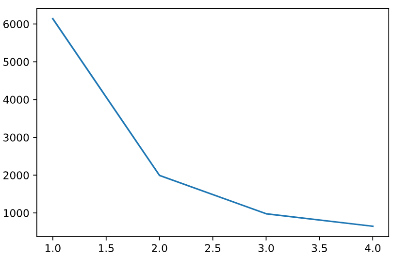
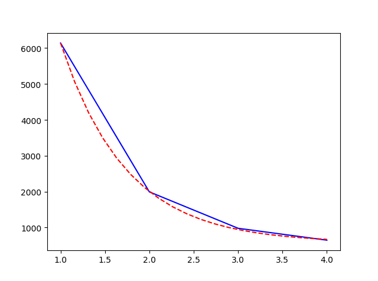

# nlp hw2
- zhang xvhao 
- li ruiyuan
## 1 manual classification
guess: R1 is possitive

possible motivation:these may result in a positive sentiment identification:
- positive words: R1 has $good, nice touch, steal the show $
- double denial: "If Busy **doesnt** get a nomination...it would be a **disaster**.
- comparison: "[another thing] which wasnt all that great"
- punctuation mark: exclamation mark and question mark may indicate excitement, strong dissatisfaction, or doubts. This can relate to nagetive sentiment. so absence of these marks indecate positive sentiment in this way.

## 2 Tokenization
### 2.1 making your own tokenizer
- v1:
```python
text = text.replace('.','')
text = text.replace(',','')
tokenized_text = str.split(text,' ')
sample_string1 = "If you have the chance, watch it. Although, a warning, you'll cry your eyes out."
sample_string2 = "Whatever is worth doing is worth doing well." #Write two more sample sentences to tokenize 
sample_string3 = "The hard part isn’t making the decision. It’s living with it."
```
description:
  we designed it mainly because a sentence is natually consisted by words which are seperated by comma and period. So if you replace all the marks with space, than split the string, you may get a series of words.
  > ['If', 'you', 'have', 'the', 'chance', 'watch', 'it', 'Although', 'a', 'warning', "you'll", 'cry', 'your', 'eyes', 'out']
 > ['Whatever', 'is', 'worth', 'doing', 'is', 'worth', 'doing', 'well']
 > ['The', 'hard', 'part', 'isn’t', 'making', 'the', 'decision', 'It’s', 'living', 'with', 'it']

- v2:
```python
  regular=re.compile("[a-zA-z']+|[0-9]+\.[0-9]+?|[^a-z0-9A-Z\s]+")
tokenized_text=regular.findall(text)
sample_string1 = "If you have the chance, watch it. Although, a warning, you'll cry your eyes out."
sample_string2 = "Night gathers, and now my watch begins. It shall not end until my death. I shall take no wife, hold no lands, father no children. I shall wear no crowns and win no glory. I shall live and die at my post. I am the sword in the darkness. I am the watcher on the walls. I am the fire that burns against the cold, the light that brings the dawn, the horn that wakes the sleepers, the shield that guards the realms of men. I pledge my life and honor to the Night’s Watch, for this night and all the nights to come." #Write two more sample sentences to tokenize 
sample_string3 = "Imagination is more important than knowledge"
```
description:
this is an updated version, we use regular expression to match words instead of split sentence. This can recognize words, numbers, then other combinations of characters other than spaces. And the three matching methods have priority to prevent token like "you?".
> ['If', 'you', 'have', 'the', 'chance', ',', 'watch', 'it', '.', 'Although', ',', 'a', 'warning', ',', "you'll", 'cry', 'your', 'eyes', 'out', '.']
['Night', 'gathers', ',', 'and', 'now', 'my', 'watch', 'begins', '.', 'It', 'shall', 'not', 'end', 'until', 'my', 'death', '.', 'I', 'shall', 'take', 'no', 'wife', ',', 'hold', 'no', 'lands', ',', 'father', 'no', 'children', '.', 'I', 'shall', 'wear', 'no', 'crowns', 'and', 'win', 'no', 'glory', '.', 'I', 'shall', 'live', 'and', 'die', 'at', 'my', 'post', '.', 'I', 'am', 'the', 'sword', 'in', 'the', 'darkness', '.', 'I', 'am', 'the', 'watcher', 'on', 'the', 'walls', '.', 'I', 'am', 'the', 'fire', 'that', 'burns', 'against', 'the', 'cold', ',', 'the', 'light', 'that', 'brings', 'the', 'dawn', ',', 'the', 'horn', 'that', 'wakes', 'the', 'sleepers', ',', 'the', 'shield', 'that', 'guards', 'the', 'realms', 'of', 'men', '.', 'I', 'pledge', 'my', 'life', 'and', 'honor', 'to', 'the', 'Night', '’', 's', 'Watch', ',', 'for', 'this', 'night', 'and', 'all', 'the', 'nights', 'to', 'come', '.']
['Imagination', 'is', 'more', 'important', 'than', 'knowledge']
description:after do
### 2.2 Using an off-the-shelf tokenizer
-  differences and which better:
  clearly, the mature API considered more situations like proper nouns and it is not a perfect way to replace the comma and period because firstly it directly changes some words(like C.I.A to CIA), secondly loses imformation like number of sentences. So we developed it and have a version 2 using regular expression to include numbers, titles with '.',and other conbinations. Also, our v1 tokenizer didn't consider other marks like "?/n:". So in this case, the function word_tokenize() from nltk is definately better.
- even when we update our own tokenizer, we still find it difficult to manage it perfectly. Still some words are special like C.I.A. which can't be recognized. Maybe a vocabulary including special words is necessary. Also we found the nltk is not always perfect.
  see ` OMG #Twitter is sooooo coooool <3 :-) <-- lol...why do i write like this idk right? :) ` nltk tokenizer seperate `:-) ` into `':', '-', ')'` but it should be a character emotions. But our tokenize did well. 
- Tokenizer should base on the corpus to achieve optimal performance. So there is no perfect tokenizer at all.
  
### 2.3 vocabulary
- q1:
> unigrams: 148127 bigrams: 148126 trigrams 148125 
- q2:
> the 8437 
and 4144 
a 4091 
of 3673 
to 3324 
is 2731 
in 2386 
it 2178 
i 2028 
this 1738 

This words are not specific verbs, noun, or adjective. They are article, preposition, linking verb or pronoun.
- q3
 times for occuring 1,2,3,4 are [6140, 1994, 979, 648]
 it looks like
 
 we thought this is a **Exponential distribution**
 assume func:y=a * np.exp(-b * x) + c
 using curve_fit(func, xdata, ydata)
 

[a,b,c]=[2.16187846e+04 1.35754115e+00 5.76131550e+02]


## 3 Text classification with a unigram language model

>k = 1

- Incorrect N-test3
Incorrect P-test32
Incorrect P-test33
Incorrect P-test34
Incorrect P-test35
Incorrect P-test36
Incorrect P-test37
Incorrect P-test39
Incorrect P-test40
Incorrect P-test43
Incorrect P-test44
Incorrect P-test45
Incorrect P-test47
Incorrect P-test48
Incorrect P-test49
- 35 out of 50 were correct! accuracy 0.7

>k = 5

- Incorrect N-test3
Incorrect P-test32
Incorrect P-test33
Incorrect P-test34
Incorrect P-test35
Incorrect P-test37
Incorrect P-test39
Incorrect P-test40
Incorrect P-test43
Incorrect P-test44
Incorrect P-test45
Incorrect P-test47
Incorrect P-test48
Incorrect P-test49
- 36 out of 50 were correct! accuracy 0.72

## 4 Text classification with a bigram language model

### 4.1 Report how you compute p(w|w′) 

$$p(w|w^{'})=\frac{c(w|w^{'})}{c(w^{'})}$$

$c(w^{'})$ is the number of times the word $w^{'}$ appears

$c(w|w^{'})$ is the number of times two word $w^{'}w$ appears together

### 4.2 What is the accuracy of this second model on the test?

>k=1

- Incorrect N-test0
Incorrect N-test13
Incorrect N-test2
Incorrect P-test25
Incorrect P-test28
Incorrect P-test30
Incorrect P-test31
Incorrect P-test32
Incorrect P-test35
Incorrect P-test37
Incorrect P-test40
Incorrect P-test42
Incorrect P-test43
Incorrect P-test44
Incorrect P-test45
Incorrect P-test47
Incorrect P-test48
Incorrect P-test49
- 32 out of 50 were correct!
accuracy 0.64

## 5  Improving the classifier

- First, we can increase the parameter k of laplace smoothing.

- Second, we can set some stop words, very frequent words like the and a.
- Third, use binary NB,
